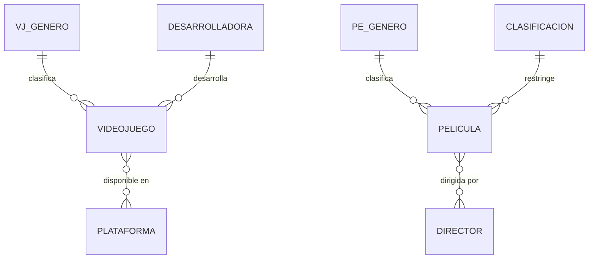

# ZonaOcio – Portal de entretenimiento (Django)

Proyecto de la asignatura **Programación Back End (TI3041)** – INACAP.

ZonaOcio es un sitio web que reúne un catálogo de **videojuegos** y una cartelera de **películas**.
Cada temática vive en una aplicación Django independiente.

| Evaluación | Alcance |
|---|---|
| Sumativa N°1 | Sitio modular con 2 apps, datos en archivos JSON, Bootstrap local y herencia de plantillas. |
| Sumativa N°2 | Datos migrados a **MySQL** con Django ORM, **Django Admin**, variables de entorno y despliegue en **AWS EC2**. |

## Tecnologías

| Tecnología | Uso |
|---|---|
| Python 3 / Django 5.2 | Framework del lado del servidor |
| MySQL / MariaDB + `mysqlclient` | Base de datos relacional (administrable con phpMyAdmin) |
| `python-dotenv` | Carga de configuraciones sensibles desde el archivo `.env` |
| Gunicorn + Apache | Servidor de aplicación y servidor web en EC2 |
| WhiteNoise | Servir archivos estáticos |
| Bootstrap 5.3.3 (local) | Interfaz de usuario (`static/bootstrap/`) |

## Modelo de datos



| App | Tabla | Finalidad | Relaciones |
|---|---|---|---|
| videojuegos | `videojuegos_genero` | Categorías de videojuegos | 1:N con videojuego |
| videojuegos | `videojuegos_desarrolladora` | Estudios desarrolladores | 1:N con videojuego |
| videojuegos | `videojuegos_plataforma` | Consolas / dispositivos | N:M con videojuego |
| videojuegos | `videojuegos_videojuego` | Catálogo de videojuegos | FK `genero_id`, FK `desarrolladora_id` |
| videojuegos | `videojuegos_videojuego_plataformas` | Tabla intermedia N:M | FK `videojuego_id`, FK `plataforma_id` |
| peliculas | `peliculas_genero` | Géneros cinematográficos | 1:N con película |
| peliculas | `peliculas_clasificacion` | Clasificación por edad (TE, TE+7, 14, 18) | 1:N con película |
| peliculas | `peliculas_director` | Directores | N:M con película |
| peliculas | `peliculas_pelicula` | Cartelera de películas | FK `genero_id`, FK `clasificacion_id` |
| peliculas | `peliculas_pelicula_directores` | Tabla intermedia N:M | FK `pelicula_id`, FK `director_id` |

## Estructura del proyecto

```
Trabajo-Backend2026/
├── manage.py
├── requirements.txt
├── .env.example              # Plantilla de variables de entorno (.env no se sube)
├── zonaocio/                 # Proyecto principal (settings.py, urls.py)
├── templates/
│   ├── base.html             # Plantilla base: navbar, encabezado, pie, estáticos
│   ├── accion_pendiente.html # Destino de los botones Agregar/Modificar/Eliminar
│   ├── includes/             # Barra de acciones y botones reutilizables
│   └── admin/base_site.html
├── static/                   # Bootstrap local, CSS e imágenes generales
├── videojuegos/              # Aplicación 1
│   ├── models.py             # Genero, Desarrolladora, Plataforma, Videojuego
│   ├── admin.py
│   ├── views.py              # Consultas con Django ORM
│   ├── urls.py
│   ├── migrations/
│   ├── management/commands/importar_videojuegos.py
│   ├── data/videojuegos.json # Datos originales (Sumativa N°1)
│   ├── static/ y templates/
├── peliculas/                # Aplicación 2 (misma estructura)
│   └── models.py             # Genero, Clasificacion, Director, Pelicula
├── deploy/                   # Servicio systemd (Gunicorn) y sitio de Apache
└── docs/                     # Documentos técnicos y guía de despliegue EC2
```

## Rutas

| URL | Descripción |
|---|---|
| `/` | Inicio: estadísticas y videojuegos destacados |
| `/videojuegos/` | Catálogo (buscar, filtrar por género, ordenar) |
| `/videojuegos/<id>/` | Ficha del videojuego |
| `/videojuegos/generos/` · `/desarrolladoras/` · `/plataformas/` | Listados de cada entidad |
| `/peliculas/` | Cartelera (tarjetas o tabla, buscar, filtrar) |
| `/peliculas/<id>/` | Ficha de la película |
| `/peliculas/generos/` · `/directores/` · `/clasificaciones/` | Listados de cada entidad |
| `/<app>/<entidad>/agregar/`, `/<id>/modificar/`, `/<id>/eliminar/` | Marcadores de posición (CRUD de la próxima evaluación) |
| `/admin/` | Django Admin: CRUD completo de todas las entidades |

## Ejecución local

Requiere un servidor MySQL o MariaDB con una base de datos y un usuario creados.

```bash
git clone https://github.com/SirGabrielValdes/Trabajo-Backend2026.git
cd Trabajo-Backend2026
python -m venv venv
source venv/bin/activate            # Windows: venv\Scripts\activate
pip install -r requirements.txt

cp .env.example .env                # completar con los datos reales
python manage.py migrate
python manage.py importar_videojuegos
python manage.py importar_peliculas
python manage.py createsuperuser
python manage.py runserver
```

## Despliegue en AWS EC2

Ver la guía completa en [`docs/GUIA_DESPLIEGUE_EC2.md`](docs/GUIA_DESPLIEGUE_EC2.md).

> Las imágenes de portada son ilustraciones SVG propias; los títulos y datos de videojuegos y
> películas son solo informativos.
